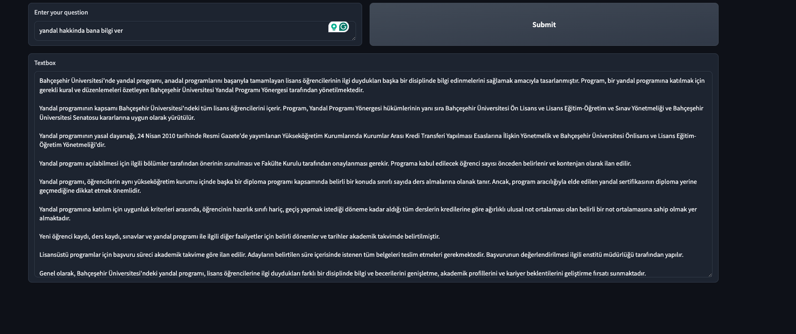

# Bau RAG


## Installation

To install the required dependencies, follow these steps:

1. Create a Conda environment named `bau_rag` with Python version 3.10:

    ```bash
    conda create -n bau_rag python=3.10
    ```

2. Activate the Conda environment:

    ```bash
    conda activate bau_rag
    ```

3. Install the dependencies listed in the `requirements.txt` file using pip:

    ```bash
    pip install -r requirements.txt
    ```

Once the dependencies are installed, you're ready to use the project.


Once you start app.py, you can access the gradio interface from the provided link in the terminal. 




## TODO:
1.  Context enrichment
2. Sentence Window Retrieval
3. Query transformations
